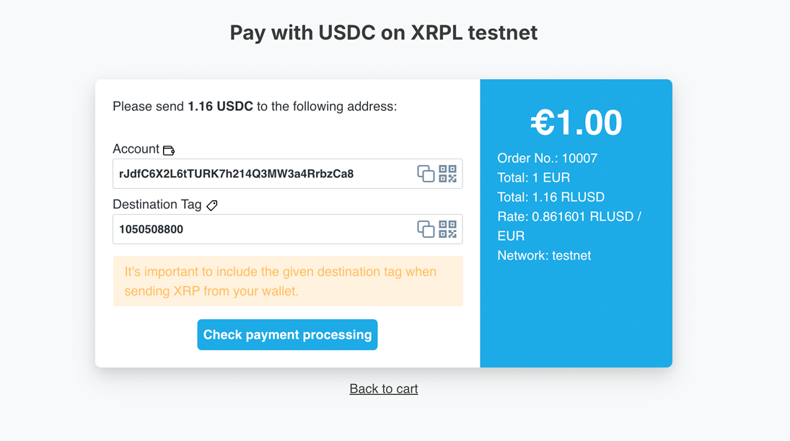

# LedgerDirect Payment plugin for WooCommerce

    LedgerDirect is a payment plugin for WooCommerce. Receive crypto and stablecoin payments directly – without middlemen, 
    intermediary wallets, extra servers or external payment providers. Maximum control, minimal detours!

Project Website: https://www.ledger-direct.com

GitHub: https://github.com/ledger-direct/ledger-direct-woocommerce

## Compatibility
- WordPress 6.7 or newer (tested up to 7.1)
- WooCommerce (latest stable recommended)
- PHP 8.1 or newer

## Install & setup instructions

### 1. Install the plugin from WordPress.org
- Download the plugin from the [WordPress Plugin Store](https://wordpress.org/plugins/ledger-direct/)
- Copy the contents of the ZIP file to the `/wp-content/plugins` directory of your WordPress installation.
- Alternatively, you can install the plugin directly from the WordPress Plugin Store by searching for "LedgerDirect" in the "Add New" plugins section.
- Activate the plugin through the 'Plugins' menu in WordPress admin.

### Manual installation
- Clone the [GitHub repo](https://github.com/ledger-direct/ledger-direct-woocommerce) to the `/wp-content/plugins` directory of your WordPress installation.
- Activate the plugin through the 'Plugins' menu in WordPress admin.

### 2. Configure the plugin
- Go to "WooCommerce" > "Settings" > "Payments"
- Find "LedgerDirect" in the list of payment methods and click "Manage"
- Enter your Merchant Wallet Address (the address where you want to receive payments)
- Configure any additional settings as needed (e.g., which network to use (Testnet or Mainnet), which currencies to accept, etc.)

## Available currencies:
- XRP (XRP Ledger)
- RLUSD (XRP Ledger)

To receive stablecoin payments, ensure you have the corresponding currencies (RLUSD, USDC etc.) enabled in the plugin settings.
The merchant wallet address needs to have the corresponding trust lines set up for the stablecoins you want to accept.

## Test Payments
To test the plugin, you can configure it to use the XRP Ledger Testnet. This allows you to simulate transactions without using real funds. Follow these steps:
1. Go to the extension settings in WordPress admin (").
2. Enable the Testnet mode.
3. Use a test XRP Ledger account to make test payments.
4. You can create test accounts from the [XRP Testnet faucet](https://xrpl.org/xrp-testnet-faucet.html) for XRP, [RLUSD Testnet faucet](https://tryrlusd.com/) for RLUSD or [Circle Testnet faucet](https://faucet.circle.com/) for USDC.

## External Services
LedgerDirect uses public APIs from Coinbase, Coingecko, Binance, and Kraken to retrieve current cryptocurrency exchange rates. These rates are needed to correctly calculate and display payments.

No personal or payment data is sent to these services. Only requests for current rates are made when a payment is processed or displayed.

For more information about each service, see:
- Coinbase API: [Terms of Service](https://www.coinbase.com/legal/user_agreement), [Privacy Policy](https://www.coinbase.com/legal/privacy)
- Coingecko API: [Terms of Service](https://www.coingecko.com/en/terms), [Privacy Policy](https://www.coingecko.com/en/privacy)
- Binance API: [Terms of Use](https://www.binance.com/en/terms), [Privacy Policy](https://www.binance.com/en/privacy)
- Kraken API: [Terms of Service](https://www.kraken.com/legal), [Privacy Policy](https://www.kraken.com/privacy)

## License
The MIT License (MIT). Please see [License File](LICENSE.md) for more information.

